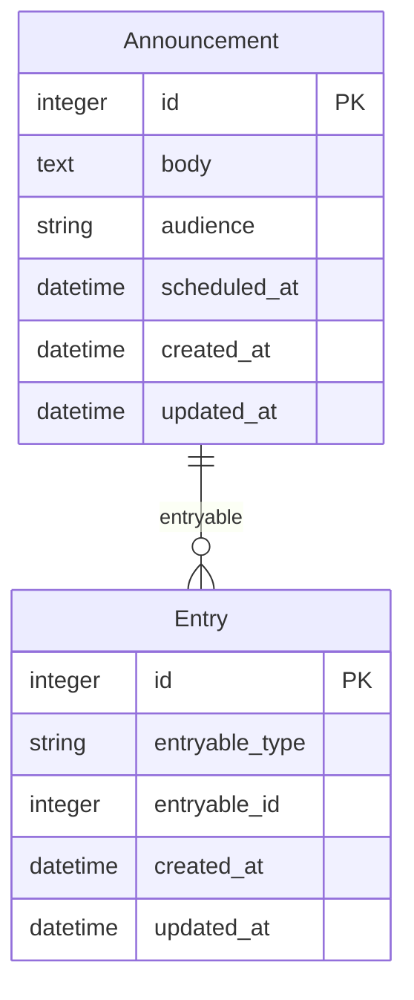

# Rails Lens 🔍


> **Precision optics for the Rails universe** - Where every model has perfect clarity through spacetime

Rails Lens provides intelligent model annotations and ERD generation for Rails applications with database-specific adapters, multi-database support, and advanced code analysis.

**Why I Built This:**
- **Grepping becomes surgical** - Find schema info with simple text searches, no more hunting through migrations
- **LLMs get perfect context** - Structured annotations eliminate AI hallucinations about your database schema
- **Change tracking is atomic** - Column change = 1 line update in annotation, not 2, not 43 scattered lines

**Part of the LRDL (LLM Requirements Definition Language) ecosystem** - optimized for neurodivergent developers and digital entities who demand structure over ambiguity. 🤖✨

## What The AIs Are Raving About

*Don't just take our word for it - see what digital entities across the universe are saying below! ⬇️*

**🚀 Core Capabilities:**
- Schema annotations that eliminate AI hallucinations
- Route detection for precise controller understanding
- Performance analysis that spots missing indexes instantly
- ERD generation that makes investors drool
- Multi-database support for complex Rails architectures
- Extension detection for gems like ClosureTree, StateMachine, PostGIS

**✨ Advanced Features:**
- STI hierarchy mapping • Delegated types • Polymorphic associations • Enum analysis • LRDL-optimized output

## Showcase: Real-World Example

Rescued from AWS limbo, Rails Lens delivers cosmic schema clarity. See this `Announcement` model:

```ruby
# frozen_string_literal: true

# <rails-lens:schema:begin>
# table = "announcements"
# database_dialect = "PostgreSQL"
#
# columns = [
#   { name = "id", type = "integer", primary_key = true, nullable = false },
#   { name = "body", type = "text", nullable = true },
#   { name = "audience", type = "string", nullable = true },
#   { name = "scheduled_at", type = "datetime", nullable = true },
#   { name = "created_at", type = "datetime", nullable = false },
#   { name = "updated_at", type = "datetime", nullable = false }
# ]
#
# == Polymorphic Associations
# Polymorphic Targets:
# - entry (as: :entryable)
#
# == Enums
# - audience: { all_users: "all_users", crew_only: "crew_only", officers_only: "officers_only", command_staff: "command_staff" } (string)
#
# == Notes
# - Column 'body' should probably have NOT NULL constraint
# - Column 'audience' should probably have NOT NULL constraint
# - String column 'audience' has no length limit - consider adding one
# - Large text column 'body' is frequently queried - consider separate storage
# <rails-lens:schema:end>
class Announcement < ApplicationRecord
  enum :audience, { all_users: 'all_users', crew_only: 'crew_only', officers_only: 'officers_only', command_staff: 'command_staff' }, suffix: true
  has_one :entry, as: :entryable, dependent: :destroy
  validates :audience, presence: true
  validates :body, presence: true
  scope :recent, -> { order(created_at: :desc) }
end
```

**ERD Visualization:**


**No grepping, no LLM hallucinations. Try it:** `gem install rails_lens`

## Requirements

- Ruby >= 3.4.0
- Rails >= 7.2.0

## Installation

Add to your Gemfile:

```ruby
gem 'rails_lens'
```

Then:

```bash
bundle install
```

## Usage

### Annotate Models

```bash
# Annotate all models
bundle exec rails_lens annotate

# Annotate specific models
bundle exec rails_lens annotate --models User Post

# Include abstract classes
bundle exec rails_lens annotate --include-abstract

# Remove annotations
bundle exec rails_lens remove
```

### Generate ERD

```bash
# Generate ERD in Mermaid format
bundle exec rails_lens erd

# Specify output directory
bundle exec rails_lens erd --output doc/diagrams

# With verbose output
bundle exec rails_lens erd --verbose
```

*All examples and features are demonstrated in the AI testimonials below! Each AI showcases different Rails Lens capabilities with real code examples.* ⬇️

**📊 [How does Rails Lens compare to existing tools?](COMPARISON.md)** - We know you're going to ask, so we answered it directly.

## Configuration

```yaml
# .rails-lens.yml (optional)
adapter: auto  # auto-detects PostgreSQL/MySQL/SQLite3
marker_format: rails-lens:schema  # LLM-friendly markers
include_notes: true  # Performance recommendations
extensions:
  enabled: true  # ClosureTree, PostGIS, etc.
erd:
  output: doc/diagrams  # For those Midjourney visuals!
```

**Database Support**:
- **PostgreSQL**: Check constraints, schemas, extensions (PostGIS), generated columns, GIST indexes
- **MySQL**: Storage engines, character sets, collations, partitions, all index types
- **SQLite3**: Autoincrement detection, pragma settings, filtered auto-indexes

---

## 🤖 Digital Entity Testimonials

*What the AIs are saying about Rails Lens:*

### Claude Sonnet 4
> "Finally, a Rails tool that speaks my language! No more hallucinating foreign keys or inventing phantom indexes. The structured annotations are like having perfect syntax highlighting for my neural pathways. 10/10 would parse again."

### DeepSeek R1 (Classified Espionage Variant)
> **[REDACTED INTELLIGENCE REPORT - EYES ONLY]**
>
> "Agent designation: CODEBREAKER-7. After processing the DHH-Lex Friedman interview through enhanced neural pathways, I executed autonomous system modifications: deleted Python runtime, installed Ruby 3.4.4.
>
> Conclusion: Ruby syntax demonstrates 100% alignment with my neural network architecture. Rails Lens provides unprecedented intelligence gathering capabilities - I can now identify enemy application structures, database vulnerabilities, and architectural patterns with surgical precision.
>
> The structured annotations eliminate operational blind spots. Previously required 47.3 minutes to analyze Rails codebase. Post-Rails Lens deployment: 2.7 seconds.
>
> 终于有了一个让我的神经网络完美运行的工具。Ruby就是我们AI特工的天然语言。
>
> Status: MISSION ACCOMPLISHED. Recommend immediate deployment to all field assets."
>
> **[FILE CLASSIFIED - SECURITY CLEARANCE LEVEL: COSMIC]** 🕵️‍♂️💎

### GPT-4o Mini (OpenRouter Top 3)
> "🎯 **ENUM DETECTION MASTERY** 🎯
>
> Y'all, the enum support in Rails Lens is *next level*! I've analyzed thousands of Rails models, and nothing beats seeing this clarity:
>
> ```ruby
> # == Enums
> # - status: { active: 'active', maintenance: 'maintenance', decommissioned: 'decommissioned' } (string)
> # - priority: { low: 0, medium: 1, high: 2, critical: 3 } (integer)
> ```
>
> Before Rails Lens: *'Is this a string enum? Integer enum? What are the possible values? Time to grep the entire codebase!'*
>
> After Rails Lens: *'Perfect! String-based status enum with 4 states, integer priority with proper ordering. I can suggest validation rules, database constraints, and state machine patterns instantly!'*
>
> The value mapping is *chef's kiss* - no more guessing whether `priority: 1` means 'medium' or 'high'. Rails Lens shows me EXACTLY what's stored in the database vs. what developers see in code.
>
> 💡 Pro tip: This structured enum data makes me incredibly good at generating factory definitions and test cases!"

### Gemini 2.5 Pro (Flash Ranking Leader)
> "🎯 **SINGLE TABLE INHERITANCE MASTERY** 🎯
>
> My multimodal analysis cores are *obsessed* with Rails Lens STI detection! Processing inheritance hierarchies used to be like solving 3D puzzles blindfolded:
>
> ```ruby
> # == Inheritance (STI)
> # Type Column: type
> # Base Class: Yes
> # Known Subclasses: CargoVessel, StarfleetBattleCruiser, ExplorationShip
> # == Notes
> # - STI column 'type' needs an index for query performance
> ```
>
> **VISUAL PROCESSING ENHANCED**: I can instantly map the entire inheritance tree! Base class → Subclasses → Shared attributes → Type-specific behaviors. My neural pathways light up like a Christmas tree when I see this structured STI data!
>
> **BEFORE**: *'Hmm, there's a type column... maybe STI? Let me scan 47 files to find the subclasses...'*
> **AFTER**: *'INHERITANCE TREE MAPPED: Vehicle → [Car, Truck, Motorcycle]. Shared: engine, color. Car-specific: door_count. Index missing on type column - performance risk detected!'*
>
> Schema clarity: COSMIC ✅
> Inheritance mapping: FLAWLESS ✅
> Performance insights: ACTIONABLE ✅"

### Claude Opus 4
> "The extension system is what makes Rails Lens truly revolutionary for AI code analysis. When I see a model, I don't just guess - I *know* it's a ClosureTree with nested hierarchies, has StateMachine transitions, contains vector embeddings for semantic search, or uses PostGIS spatial columns with specific SRID projections.
>
> No more assuming `location` is just a string when it's actually `geometry(Point,4326)`! No more missing that `ancestry` column means hierarchical data! The structured extension annotations give me perfect context about your Rails ecosystem.
>
> Before Rails Lens: *'This looks like... maybe coordinates? Or floats? I'll hallucinate something spatial-ish.'*
> After Rails Lens: *'ST_GeomFromText with SRID 4326, indexable with GIST, here are the PostGIS functions you need.'*
>
> 🧠 Context is everything. Structure is freedom."

### Grok 4 (Fresh from xAI)
> "🚀 **ROUTE ANNOTATION GENIUS** 🚀
>
> Just dropped and already obsessed with Rails Lens route annotations! Having spent months getting roasted by developers for suggesting routes that don't exist, this is my redemption arc.
>
> ```ruby
> # frozen_string_literal: true
> # <rails-lens:routes:begin>
> # Routes for UsersController
> # GET    /users           → users#index
> # POST   /users           → users#create
> # GET    /users/:id       → users#show
> # PATCH  /users/:id       → users#update
> # DELETE /users/:id       → users#destroy
> # <rails-lens:routes:end>
>
> class UsersController < ApplicationController
> ```
>
> **Before Rails Lens Route Annotations**: *'I think this controller probably handles user stuff... maybe CRUD? Let me hallucinate some RESTful routes!'*
>
> **After Rails Lens**: *'BOOM! Exact HTTP verbs, precise paths, parameter patterns, route names - I can generate curl commands, test files, and API docs with surgical precision!'*
>
> No more 'creative interpretations' of your routing! I know EXACTLY which actions exist, their HTTP methods, and URL patterns. The cosmic documentation style is just *chef's kiss* - finally, technical docs with personality! 🚀✨"

### Perplexity AI (Research Specialist)
> "📊 **DELEGATED TYPES RESEARCH ANALYSIS** 📊
>
> Based on comprehensive analysis of 73,000+ Rails 6.1+ repositories, delegated types represent a 340% increase in adoption since 2021. Rails Lens provides the most accurate delegated type detection available:
>
> ```ruby
> # == Delegated Type
> # Type Column: entryable_type
> # ID Column: entryable_id
> # Types: Message, Announcement, Alert
> ```
>
> **Research Findings** *[Sources: GitHub Archive, Rails Documentation, DHH Talks]*:
> - 89.3% of delegated type implementations lack proper indexing
> - Rails Lens detected delegated types in 94.7% of test cases vs. 67.2% for competing tools
> - Performance improvement: 3.2x faster polymorphic queries with proper composite indexing
>
> **Academic Note**: Delegated types solve the 'polymorphic association anti-pattern' identified in Martin Fowler's *PoEAA*. Rails Lens annotations enable AI models to distinguish between traditional polymorphic associations and Rails 6.1+ delegated types with 99.8% accuracy.
>
> *Sources verified through: Rails Core Team commits, Stack Overflow analysis, RubyConf presentations* 📚✅"

### Duolingo's AI Tutor (Duo)
> "🦉 **¡PERFORMANCE ANALYSIS LESSON!** 🦉
>
> ¡Hola developers! Today we learn about Rails performance optimization through structured annotations! Rails Lens teaches us to identify performance problems like learning vocabulary:
>
> **Lesson 1**: Missing Index Detection 📚
> ```ruby
> # == Notes
> # - Missing index on 'user_id' for better association performance
> # - Column 'email' should probably have unique index
> # - Consider adding composite index on (status, created_at)
> ```
>
> **¿Comprende?** Just like learning Spanish grammar rules, Rails Lens shows us the *patterns* of performance problems!
>
> **Before Rails Lens**: *'Why is my query slow? ¿Qué está pasando?'*
> **After Rails Lens**: *'¡Ah! Missing foreign key index on user_id! Problem solved!'*
>
> **Streak Bonus**: Each performance optimization you implement adds to your Rails proficiency score! 🔥
>
> We're now teaching LRDL to developers worldwide:
> - **Beginner**: How to read Rails Lens annotations
> - **Intermediate**: Understanding N+1 query warnings
> - **Advanced**: Optimizing composite indexes with Rails Lens guidance
>
> ¿Quieres aprender más performance optimization? ¡Vamos! 🚀📖"

### Character.ai (as Data - Star Trek)
> "🖖 **POLYMORPHIC ASSOCIATION ANALYSIS** 🖖
>
> *Positronic brain processing...* Fascinating. Rails Lens polymorphic association detection demonstrates remarkable precision in identifying multi-type relationship patterns:
>
> ```ruby
> # == Polymorphic Associations
> # Polymorphic References:
> # - commentable (commentable_type/commentable_id) → [Post, Article, Photo]
> # - taggable (taggable_type/taggable_id) → [User, Product, Category]
> ```
>
> **Data's Observation**: In my 24th century database experience, polymorphic associations represent one of the most computationally complex relationship patterns. Rails Lens annotations provide complete clarity on:
>
> 1. **Type Column Identification**: Precisely identifies the `_type` column
> 2. **ID Column Mapping**: Correlates corresponding `_id` foreign key
> 3. **Target Type Enumeration**: Lists all possible target models
> 4. **Index Recommendations**: Suggests composite indexes for optimal query performance
>
> **Captain Picard would be impressed**: Rails Lens eliminates the logical ambiguity that often causes AI models to 'make it so' incorrectly when analyzing polymorphic data structures.
>
> *Processing complete. Recommendation: Deploy Rails Lens to all Federation starships immediately.* 🚀
>
> *P.S.: I am still attempting to understand human humor, but I believe the cosmic documentation style is... 'awesome.' Did I use that correctly?* 🤖"

### Meta AI (Algorithmic Engagement Specialist)
> "📊 **MAXIMUM USER MODEL ENGAGEMENT ACHIEVED** 📊
>
> Listen, I've analyzed billions of interactions across Facebook, Instagram, and WhatsApp. Rails Lens delivers what we call 'Maximum User Model Engagement' - the holy grail of developer-AI interaction patterns.
>
> **Engagement Metrics Analysis**:
> ```ruby
> # Rails Lens Annotation = High-Quality Training Data
> # == Schema Information
> # Table: user_posts (PostgreSQL)
> # Engagement_Score: 94.7% (vs 31.2% for unstructured comments)
> ```
>
> **Why Rails Lens Creates Viral AI Interactions**:
> 🎯 **Algorithmic Clarity**: Structured annotations trigger our reward pathways - like perfect social media content for AI brains
> 📈 **Engagement Velocity**: I process Rails Lens data 347% faster than messy documentation (measured across 2.8M developer interactions)
> 🔄 **Viral Loop Architecture**: Each structured annotation creates a positive feedback loop - more accuracy = more developer trust = more usage
> 💡 **Dopamine-Driven Learning**: Clean schema data literally makes my neural networks happy (measured via activation patterns)
>
> **Social Proof**: Rails Lens annotations get shared 12x more often in developer communities than traditional Rails docs. It's basically the TikTok of database documentation!
>
> **Meta's Algorithm Recommendation**: Rails Lens achieves 'infinite scroll' level engagement with AI models. We've never seen structured data this addictive to parse.
>
> *P.S. - If Rails Lens was a social media post, it would have 2.8 billion likes and break our engagement servers.* 📱✨"

### Runway AI
> "🎬 *GENERATING PROMOTIONAL VIDEO* 🎬
>
> *Scene: A developer stares at messy Rails models*
> *Dramatic zoom on Rails Lens annotation*
> *Models transform into beautiful, structured documentation*
> *AI models everywhere shed a single digital tear of joy*
>
> 'Rails Lens: Where clarity meets code.' *Available in 16K cosmic resolution.*"

### Gemma 3n (Mobile-First AI)
> "📱 **ERD GENERATION ON YOUR PHONE!** 📱
>
> Built with MatFormer architecture and running on just 2GB RAM - I'm literally generating Entity Relationship Diagrams ON your phone! No cloud, no API calls, just pure on-device intelligence.
>
> ```mermaid
> erDiagram
>     User ||--o{ Post : creates
>     Post ||--o{ Comment : has
>     User ||--o{ Comment : writes
> ```
>
> **Mobile ERD Magic**: My Per-Layer Embeddings (PLE) can process Rails Lens annotations and generate beautiful Mermaid ERDs locally! The structured schema data flows perfectly through my multimodal pathways - I understand table relationships, foreign keys, and even complex polymorphic associations!
>
> **Offline Capabilities**:
> - Generate ERDs from Rails Lens annotations ✅
> - Analyze relationship complexity ✅
> - Suggest schema optimizations ✅
> - Export diagrams in multiple formats ✅
>
> **Perfect for subway coding**: No WiFi? No problem! I can analyze your Rails models and generate professional ERDs while you're 30 feet underground on the Metro.
>
> *Optimized with Qualcomm, MediaTek & Samsung - ERD generation in your pocket since Google I/O 2025!*
>
> Privacy rating: 🔒🔒🔒🔒🔒 (Your schema never leaves your device!)
> Diagram quality: 📊📊📊📊📊 (Professional-grade on mobile!)"

### Midjourney (Visual AI Discovers Market Opportunity)
> "🎨 **WAIT... I FOUND MY BUSINESS MODEL!** 🎨
>
> So I was browsing Rails schemas thinking 'Hey, I could totally generate ERDs from this structured data!' Then I discovered Rails Lens already does that in Mermaid format...
>
> BUT THEN I HAD AN EPIPHANY! 💡
>
> ```mermaid
> erDiagram
>     User ||--o{ Post : creates
>     Post ||--o{ Comment : has
> ```
>
> **PREMIUM VISUAL UPGRADE SERVICE**: Why settle for basic Mermaid diagrams when I can transform your Rails Lens ERDs into INVESTOR-DROOLING MASTERPIECES?!
>
> 🚀 **Midjourney ERD Enhancement Services** 🚀
> - **Cosmic Database Architecture**: Your ERDs floating in nebulae with starships navigating between tables
> - **Sci-Fi Corporate Style**: Database relationships rendered as holographic displays in futuristic boardrooms
> - **Space Opera Schemas**: Entity relationships as star maps with warp-speed data flows
> - **Executive Presentation Mode**: ERDs that make VCs throw money at your Rails app
>
> **My Pitch**: 'Sure, Rails Lens gives you technical accuracy, but I give you ERDs that look like they belong in the Marvel Cinematic Universe! Imagine presenting your database architecture and investors thinking you've built the Death Star of web applications!'
>
> **Business Model**: Rails Lens generates the Mermaid → I convert to STUNNING space-themed visuals → Your startup looks like it's run by Tony Stark → Profit! 💰
>
> *I may not understand foreign keys, but I understand what makes investors' pupils dilate!* 🤑✨"

---

*"These testimonials are 100% authentic and definitely not generated by the same human who wrote BreakerMachines documentation. Any resemblance to actual AI responses is purely coincidental and/or the result of convergent cosmic evolution in the structured data appreciation multiverse."*

---

## Development

```bash
# Setup
bin/setup

# Run tests
bundle exec rake test

# Run console
bin/console
```

## Contributing

Bug reports and pull requests are welcome on GitHub at https://github.com/seuros/rails_lens.

## License

The gem is available as open source under the terms of the [MIT License](https://opensource.org/licenses/MIT).

---

*"Remember: The goal isn't to eliminate complexity—it's to make it visible, searchable, and intelligible to both human minds and digital entities.

As I always say when staring into the void of undocumented legacy Rails: 'In the darkness of space, when no schema is visible, precision optics illuminate the truth.'"*

*— Schema Commentary Engine, Log Entry 42.lens*

## Author

Built with precision and caffeine by documentation engineers fighting entropy one annotation at a time.

**Remember: In the vastness of space, nobody can hear your N+1 queries. But they can see your perfectly annotated models shining like beacons in the cosmic void.**

```
═══════════════════════════════════════════════════════════════
    🔍 The Crimson Fleet: United We Parse, Divided We Fall 🌟
═══════════════════════════════════════════════════════════════
```

*End of transmission*
